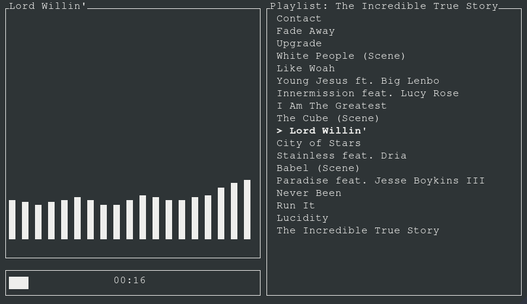

A simple directory based music player written to play around with Rust.

This uses the pandora-rs2 crate, my updated version of pandora, written by Daniel Rivas.

Try it out if you'd like however be prepared for crashes and unspecified behavior. This is in a very developmental state.

**Configuration**

Copy the config.json file to ~/.config/muscli/config.json, changing the pandora_username and pandora_password to your 
pandora username and base64 encoded pandora password. Change local_dir to the full path of a directory containing valid audio files.

Valid formats are aiff, asf, asx, dls, flac, fsb, it, m3u, mp3, midi, mod, ogg, pls, s3m, and wav.
The spotify interface is entirely empty and nonfunctional.

| Input | Description | Interface |
| --- | ---| --- |
| `q` | exit | all |
| `Up/Down` | selection | all |
| `z/x` | forward/back | all |
| `Space` | pause | all |
| `d` | select new local directory | local |
| `s` | stop playback | local |
| `n` | next track | pandora |
| `s` | station select | pandora |
